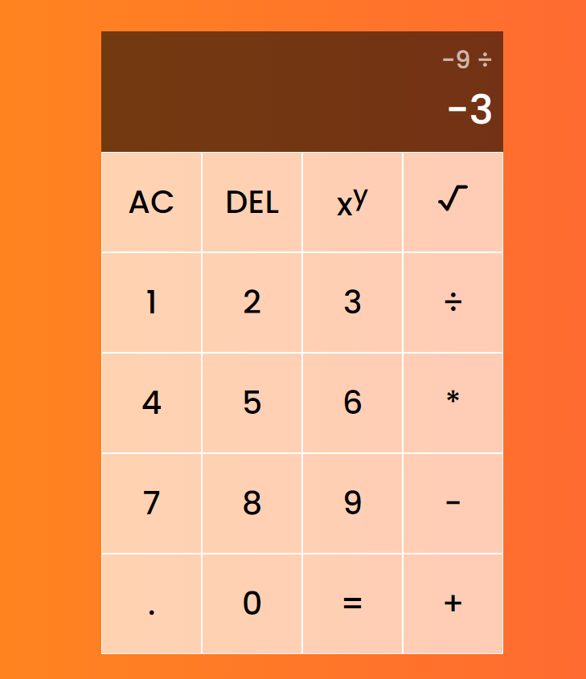
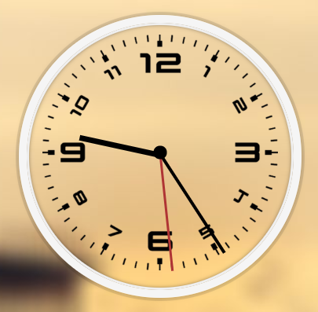
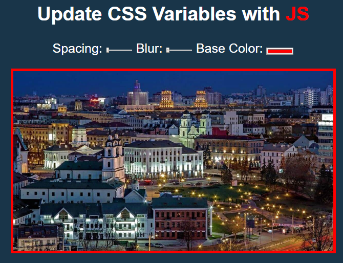
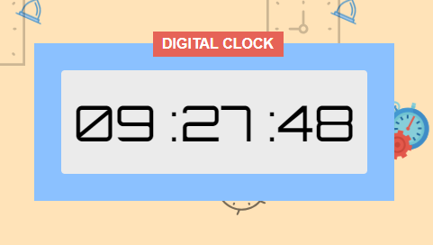
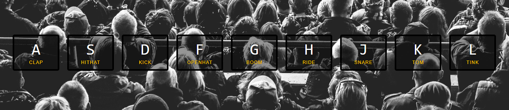
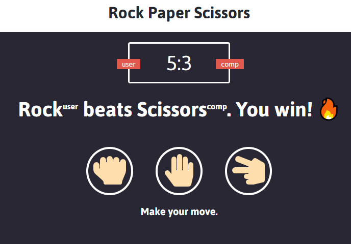
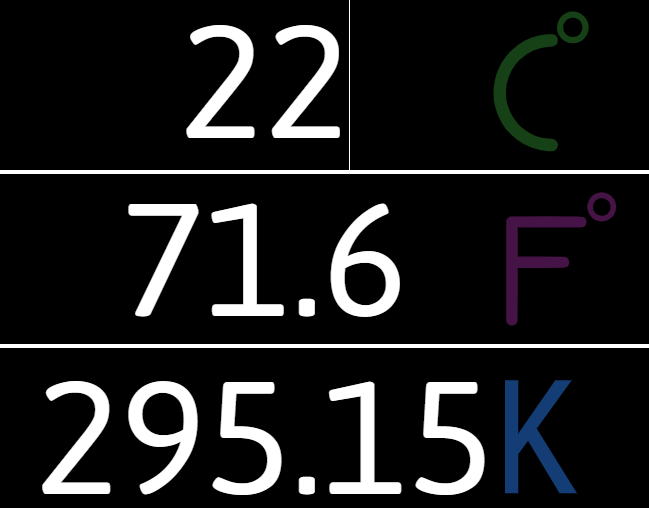

## <a href="https://ilyakozak.github.io/js-mini-projects/calculator">Calculator</a>

#### <a href="https://github.com/IlyaKozak/js-mini-projects/tree/master/calculator">github</a>

 

---

## <a href="https://ilyakozak.github.io/js-mini-projects/sliding-puzzle">Sliding Puzzle</a>

#### <a href="https://github.com/IlyaKozak/js-mini-projects/tree/master/sliding-puzzle">github</a>

 

---

## <a href="https://ilyakozak.github.io/js-mini-projects/advent-calendar">Advent Calendar</a>

#### <a href="https://github.com/IlyaKozak/js-mini-projects/tree/master/advent-calendar">github</a>

 
based on https://www.youtube.com/watch?v=KXPD11CQLGE

---

## <a href="https://ilyakozak.github.io/js-mini-projects/analog-clock">Analog Clock</a>

#### <a href="https://github.com/IlyaKozak/js-mini-projects/tree/master/analog-clock">github</a>

 
based on https://javascript30.com/

---

## <a href="https://ilyakozak.github.io/js-mini-projects/css-variables">Css Variables</a>

#### <a href="https://github.com/IlyaKozak/js-mini-projects/tree/master/css-variables">github</a>

 
based on https://javascript30.com/

---

## <a href="https://ilyakozak.github.io/js-mini-projects/digital-clock">Digital Clock</a>

#### <a href="https://github.com/IlyaKozak/js-mini-projects/tree/master/digital-clock">github</a>

 
based on https://www.whatsdev.com/

---

## <a href="https://ilyakozak.github.io/js-mini-projects/drum-kit">Drum Kit</a>

#### <a href="https://github.com/IlyaKozak/js-mini-projects/tree/master/drum-kit">github</a>

 
based on https://javascript30.com/

---

## <a href="https://ilyakozak.github.io/js-mini-projects/rock-paper-scissors">Rock-Raper-Scissors</a>

#### <a href="https://github.com/IlyaKozak/js-mini-projects/tree/master/rock-paper-scissors">github</a>

 
based on https://www.whatsdev.com/

---

## <a href="https://ilyakozak.github.io/js-mini-projects/temperature-converter">Temperature Converter</a>

#### <a href="https://github.com/IlyaKozak/js-mini-projects/tree/master/temperature-converter">github</a>

 
based on https://www.whatsdev.com/

---
